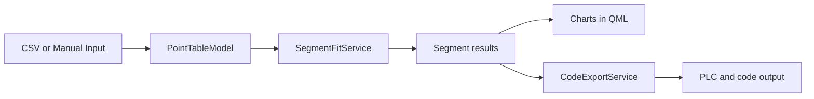

# Segmented Linear Fit Encoder

Qt 6 + C++ desktop application for building a piecewise linear approximation from measured data.

The current app is shipped as `Piecewise Linear Fit Studio` and supports:

- CSV import
- manual point generation
- editable point tables
- piecewise linear analysis
- residual review charts
- code export for PLC, Python, C++, JavaScript, Java, and C#

## Project Flow



## Documentation

Full project documentation is available in:

- [`docs/index.md`](./docs/index.md) for the main documentation home

Serve the docs locally with:

```bash
pip install -r requirements-docs.txt
python -m mkdocs serve
```

Mermaid diagrams are already enabled in the docs site through the MkDocs configuration.

It covers:

- architecture
- backend file reference
- QML file reference
- data flow
- segmentation algorithm
- mathematical background
- chart generation
- export behavior
- relationship with the legacy notebook

## Screenshots

The most important views are shown below.

For the full screenshot gallery, see [`docs/screenshots.md`](./docs/screenshots.md).

### CSV Import


### Piecewise Fit Results


### Code Export


## Open In Qt Creator

Open `CMakeLists.txt`, not `.pro` or `.pyproject`.

## Build On Windows With Qt

```powershell
C:\Qt\6.10.2\llvm-mingw_64\bin\qt-cmake.bat -S . -B build-cpp-qt -G Ninja -DCMAKE_MAKE_PROGRAM=C:/Qt/Tools/Ninja/ninja.exe -DCMAKE_CXX_COMPILER=C:/Qt/Tools/llvm-mingw1706_64/bin/clang++.exe
C:\Qt\Tools\Ninja\ninja.exe -C build-cpp-qt
C:\Qt\6.10.2\llvm-mingw_64\bin\windeployqt.exe --qmldir qml build-cpp-qt\piecewise-linear-fit.exe
```

Expected executable:

- `build-cpp-qt/piecewise-linear-fit.exe`

## Repository Layout

- `src/`: C++ backend
- `qml/`: Qt Quick UI
- `files/`: sample CSV files and the legacy notebook
- `docs/`: project documentation

## Sample Files

- `files/data1_length.csv`
- `files/data2_length.csv`
- `files/segmented_linear_fit.ipynb`
