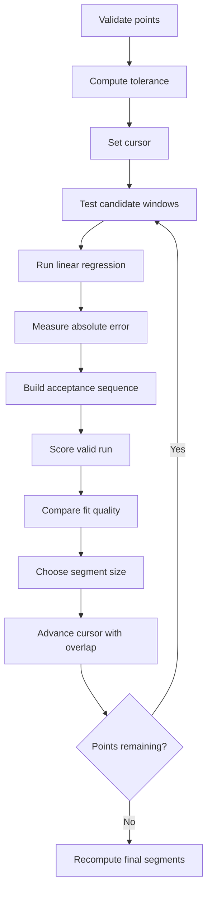

# Segmentation Algorithm

This page explains how the current application splits a measured curve into consecutive linear segments.

The implementation lives in `src/SegmentFitService.cpp`.

## Goal

Given an ordered list of points, the service tries to identify contiguous ranges that can be approximated well by straight lines.

The final output is a list of `SegmentResult` values containing:

- start and end indices
- start and end `X`
- slope
- intercept
- `R^2`

## Current Options

The public options structure currently exposes:

- `minimumPointsPerSegment = 4`
- `fitTolerancePercent = 0.01`

## Workflow

## Step 1: Validation

The analysis stops early if:

- there are fewer than 2 points
- any point is missing `Y`

## Step 2: Absolute Tolerance

The service derives an absolute error tolerance from the maximum absolute output value in the dataset.

That lets the tolerance scale with the dataset instead of being hard-coded in raw output units.

The exact formula is documented on the [Mathematics](mathematics.md) page.

## Step 3: Candidate Generation

At a given cursor position, the algorithm tests candidate windows starting at the current point and growing forward.

If the cursor is at index `k`, it tests:

- `k..k+minPoints-1`
- `k..k+minPoints`
- `k..k+minPoints+1`
- and so on until the remaining dataset is exhausted

## Step 4: Candidate Scoring

Each candidate gets two signals:

- longest consecutive run of points that stay within tolerance
- coefficient of determination, `R^2`

The algorithm does not simply take the best `R^2`. It mixes both criteria.

## Step 5: Segment Size Decision

The service finds:

- the candidate with the best valid run
- the candidate with the best `R^2`

Then it chooses the smaller of the two suggested candidate sizes.

That keeps the decision conservative and closer to the notebook logic that inspired the app.

## Step 6: Shared Boundary Point

When a segment is accepted, the cursor advances by `chosenCount - 1`, not by `chosenCount`.

This means:

- the last point of one segment
- becomes the first point of the next segment

That overlap preserves continuity between neighboring segments.

## Step 7: Final Regression Pass

After the segment boundaries are decided, the service runs regression again on each final segment.

Those final values are then used by:

- segment cards
- fitted line charts
- residual charts
- code export

## Edge Rules

The implementation has a few safety rules:

- if exactly one point would remain at the end, it gets absorbed by the current segment
- if the final segment would have fewer than 2 points, it is merged back into the previous segment when possible

## Output Beyond The Raw Segments

Once `AppController` receives the final segments, it derives more presentation data:

- segmented point series
- fitted line series
- global residual series
- per-segment residual series
- outlier markers
- summary text

The segmentation service itself only returns the numerical segment result, not the full charting layer.

## Assumptions

- points should be ordered by `X`
- all points need a `Y` value before analysis
- repeated or nearly repeated `X` values can invalidate regression windows

## What This Algorithm Is Not

This is not:

- dynamic programming segmentation
- a global least-cost optimizer
- formal changepoint detection

It is an incremental heuristic designed to stay close to the original notebook behavior while remaining maintainable in C++.
