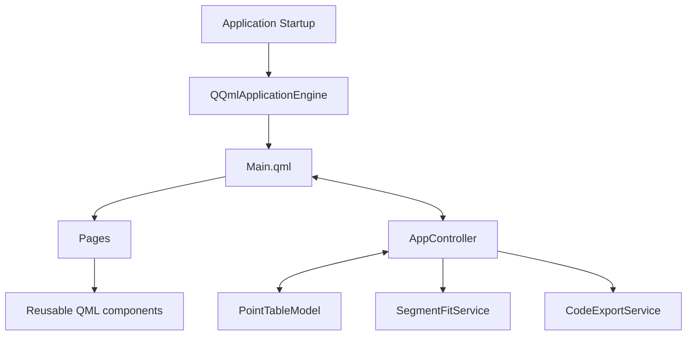
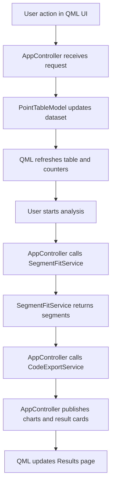
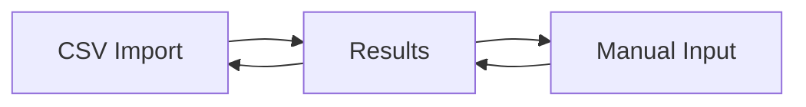

# Architecture

This page describes how the Qt application is structured and how data moves between QML and C++.

## Layered View

## Runtime Startup

`src/main.cpp` is intentionally small.

Its job is to:

- create `QGuiApplication`
- set the application name and organization
- select the `Basic` Qt Quick Controls style
- create `AppController`
- expose `appController` to QML
- load `Main.qml` through the `PiecewiseLinearFit` QML module

## Architectural Roles

| Layer | Main files | Responsibility |
| --- | --- | --- |
| startup | `src/main.cpp` | create the app and QML engine |
| state bridge | `src/AppController.*` | coordinate UI actions, state, analysis, and presentation data |
| data model | `src/PointTableModel.*`, `src/PointTypes.h` | store editable points and computed segment results |
| analysis | `src/SegmentFitService.*` | compute piecewise linear segments |
| export | `src/CodeExportService.*` | generate target-language code |
| UI shell | `qml/Main.qml` | define layout, navigation, theme, and high-level page switching |
| UI pages | `qml/pages/*.qml` | CSV input, manual input, and results flows |
| UI components | `qml/components/*.qml` | reusable buttons, cards, plots, and tables |

## Controller-Centered State Model

`AppController` is the application state hub.

It exposes QML properties for:

- point availability and counts
- current status text
- CSV header naming behavior
- computed segment summaries
- chart-ready series
- export target selection
- generated export code

This keeps the responsibilities split cleanly:

- QML drives user interaction and layout
- C++ owns parsing, calculations, and data reshaping

## Data Flow

## Result Presentation Pipeline

After the algorithm runs, `AppController` converts raw `SegmentResult` values into UI-facing structures:

- segment cards for the results page
- segmented point series
- fitted line series
- global residual series
- segment residual series
- outlier marker series
- summary text
- PLC and target-language code blocks

That presentation rebuild happens in one place so the UI does not need to understand the raw algorithm output.

## CSV Header Naming Flow

The current app includes a metadata path for CSV headers.

If the first row is a header and the user enables header-based naming:

- table labels use the detected input/output names
- result chart axis labels use those names
- exported code uses sanitized versions of those names

This is managed through:

- `csvHeadersAvailable`
- `useCsvHeadersAsNames`
- `inputDisplayName`
- `outputDisplayName`
- `csvHeaderSummary`

## State Invalidation

Whenever the point dataset changes, old computed results are cleared.

That means the app removes:

- segment cards
- chart series
- summary text
- exported code

This prevents stale output from remaining visible after edits.

## Navigation Structure

`qml/Main.qml` uses a `StackLayout` with three pages:

- `CsvPage`
- `ManualPage`
- `ResultsPage`

The selected page is driven by a simple `currentPage` integer.

## Design Notes

- The app keeps business logic in C++, not in QML.
- The chart renderer is custom and based on `Canvas`, not `QtCharts`.
- The controller acts as both action coordinator and view-model.
- The current segmentation strategy is heuristic and incremental, not a global optimization pass.
