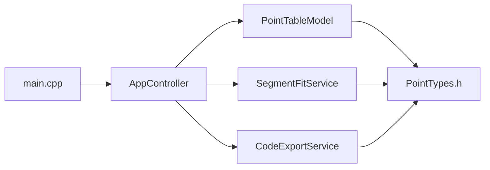

# Backend Reference

This page explains the C++ backend file by file.

## Source Folder Map

| File | Responsibility |
| --- | --- |
| `src/main.cpp` | application startup and QML engine setup |
| `src/AppController.h` | public controller API exposed to QML |
| `src/AppController.cpp` | CSV loading, point generation, result rebuilding, clipboard actions |
| `src/PointTypes.h` | shared plain data types |
| `src/PointTableModel.h` | editable list model interface |
| `src/PointTableModel.cpp` | model roles, numeric parsing, row editing |
| `src/SegmentFitService.h` | segmentation service API and options |
| `src/SegmentFitService.cpp` | linear regression and segmentation heuristic |
| `src/CodeExportService.h` | export service API |
| `src/CodeExportService.cpp` | target-language code generation and identifier sanitization |

## Backend Dependency View

## `src/main.cpp`

This file is the bootstrap entry point.

Key responsibilities:

- create the Qt GUI application
- create the controller instance
- publish the controller to QML as `appController`
- load the `PiecewiseLinearFit` QML module

It intentionally keeps no business logic.

## `src/PointTypes.h`

This file defines the two central plain data types.

### `DataPoint`

- `x`: required input coordinate
- `y`: optional output coordinate while the dataset is incomplete

### `SegmentResult`

- index range for the segment
- start and end `X`
- slope
- intercept
- `R^2`

These structures are shared by the model, analysis, and export code.

## `src/PointTableModel.*`

`PointTableModel` is a `QAbstractListModel` used directly by the QML points table.

### Roles

| Role | Meaning |
| --- | --- |
| `xValue` | raw numeric `X` |
| `yValue` | raw numeric `Y` |
| `displayX` | formatted `X` string |
| `displayY` | formatted `Y` string |
| `validY` | whether `Y` is present |

### Important Behavior

- accepts `.` and `,` decimal input
- allows `Y` to be empty
- emits `dataChanged` for inline table editing
- uses `beginResetModel()` and `endResetModel()` when the whole dataset changes

## `src/AppController.*`

`AppController` is the main backend facade used by QML.

### Public Actions

| Method | Purpose |
| --- | --- |
| `loadCsv()` | load a CSV file and build a point dataset |
| `generatePoints()` | generate evenly spaced `X` values with empty `Y` |
| `clearPoints()` | clear the current dataset |
| `updatePointX()` / `updatePointY()` | edit individual cells |
| `addPoint()` / `removePoint()` | manage custom rows |
| `sortPointsByX()` | stabilize custom datasets before analysis |
| `runAnalysis()` | call the segmentation service and rebuild results |
| `copyPlcCode()` / `copyExportCode()` | copy generated output to the clipboard |

### Key Exposed Properties

| Property group | Examples |
| --- | --- |
| dataset state | `hasPoints`, `pointCount`, `missingYCount` |
| chart data | `segmentedPointSeries`, `fittedLineSeries`, `globalResidualSeries` |
| export state | `exportTargets`, `exportTarget`, `exportCode`, `plcCode` |
| CSV naming | `csvHeadersAvailable`, `useCsvHeadersAsNames`, `inputDisplayName`, `outputDisplayName` |

### Important Internal Helpers

- `invalidateResults()`: clears stale results when points change
- `clearCsvHeaderMetadata()`: resets header-derived names
- `rebuildResultPresentation()`: converts raw segments into UI-ready cards, charts, and export strings
- `exportInputName()` and `exportOutputName()`: pass header-based names into the export service when enabled

## `src/SegmentFitService.*`

This service owns the segmentation algorithm.

### Public API

- `SegmentFitService::analyze(points, options)`

### Returned Data

- vector of `SegmentResult`
- absolute tolerance used during the run
- error text if the analysis fails

### Important Design Choices

- requires all points to have `Y`
- uses local linear regression on growing candidate blocks
- scores candidates by longest valid run and `R^2`
- reuses the last point of one segment as the first point of the next

Detailed behavior is documented on the [Segmentation Algorithm](algorithm.md) page.

## `src/CodeExportService.*`

This service translates segments into executable code strings.

### Supported Targets

- PLC
- Python
- C++
- JavaScript
- Java
- C#

### Current Features

- target-specific condition syntax
- identifier sanitization
- optional use of CSV header names as export variable names
- lower-range fallback to zero

Detailed examples are documented on the [Code Export](export.md) page.

## Backend Error Handling

The backend mostly communicates failures through:

- status messages exposed by `AppController`
- error strings returned by `SegmentFitService`

Examples:

- missing file
- invalid numeric values
- missing `Y` data
- impossible regression cases

## Practical Reading Order

If you are exploring the backend for the first time:

1. read `src/main.cpp`
2. read `src/AppController.h`
3. read `src/AppController.cpp`
4. read `src/SegmentFitService.cpp`
5. read `src/CodeExportService.cpp`
