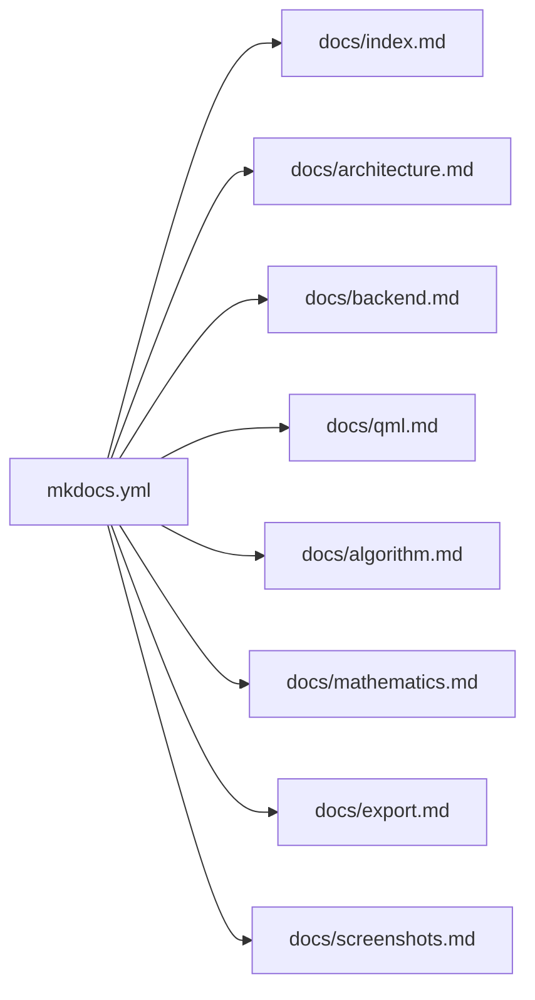

# Getting Started

This page explains how to run the desktop app and how to serve the documentation site locally.

## Requirements

For the application:

- Qt 6.5 or newer
- CMake 3.21 or newer
- a supported C++17 compiler
- Ninja if you want to use the provided command example

For the documentation site:

- Python 3
- MkDocs

## Open The Project In Qt Creator

Open the repository through `CMakeLists.txt`.

Do not open it as:

- `.pro`
- `.pyproject`

## Build On Windows

Example command sequence:

```powershell
C:\Qt\6.10.2\llvm-mingw_64\bin\qt-cmake.bat -S . -B build-cpp-qt -G Ninja -DCMAKE_MAKE_PROGRAM=C:/Qt/Tools/Ninja/ninja.exe -DCMAKE_CXX_COMPILER=C:/Qt/Tools/llvm-mingw1706_64/bin/clang++.exe
C:\Qt\Tools\Ninja\ninja.exe -C build-cpp-qt
C:\Qt\6.10.2\llvm-mingw_64\bin\windeployqt.exe --qmldir qml build-cpp-qt\piecewise-linear-fit.exe
```

Expected executable:

- `build-cpp-qt/piecewise-linear-fit.exe`

## Sample Data

The repository includes:

- `files/data1_length.csv`
- `files/data2_length.csv`
- `files/segmented_linear_fit.ipynb`

These files are useful for:

- checking the CSV import flow
- validating chart output
- comparing the current implementation with the original notebook

## First Application Walkthrough

1. Launch the app.
2. Go to `CSV Import` and load a sample CSV, or use `Manual Input`.
3. Ensure all `Y` values are filled.
4. Press `Analyze`.
5. Review the fit charts, error charts, segments, and generated code.

## Serve The Docs Site

Install documentation dependencies:

```bash
pip install -r requirements-docs.txt
```

Start the local docs server:

```bash
python -m mkdocs serve
```

Useful validation command:

```bash
python -m mkdocs build --strict
```

## Docs Site Structure



## Repository Layout

```text
src/    C++ backend and services
qml/    QML pages and reusable components
files/  sample CSV files and the legacy notebook
docs/   MkDocs documentation source
```
