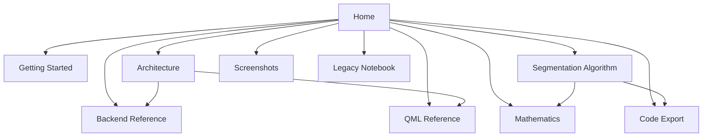
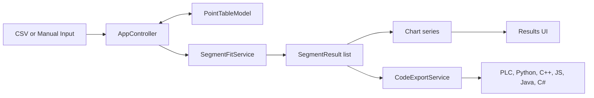

# Segmented Linear Fit Encoder Documentation

This site documents the current `Piecewise Linear Fit Studio` application from the top level down to the implementation details.

It covers:

- application structure
- C++ backend responsibilities
- QML page and component layout
- segmentation workflow
- mathematical background
- export logic
- screenshots and legacy context

## Documentation Map

## What The Application Does

`Piecewise Linear Fit Studio` is a Qt 6 desktop application that takes measured points and approximates them with several linear segments instead of one global line.

Main capabilities:

- load measured data from CSV
- generate manual ranges
- edit points directly in the UI
- compute piecewise linear segments
- inspect fit and residual charts
- export the final equations to multiple code targets

## Quick System View

## Suggested Reading Order

1. Start with [Getting Started](getting-started.md) if you want build and run instructions.
2. Continue with [Architecture](architecture.md) for the system view.
3. Use [Backend Reference](backend.md) and [QML Reference](qml.md) for file-by-file explanations.
4. Read [Segmentation Algorithm](algorithm.md) and [Mathematics](mathematics.md) for the numerical side.
5. Use [Code Export](export.md) and [Screenshots](screenshots.md) for output behavior and UI examples.

## Visual Overview

Available on the [Screenshots](screenshots.md) page.
