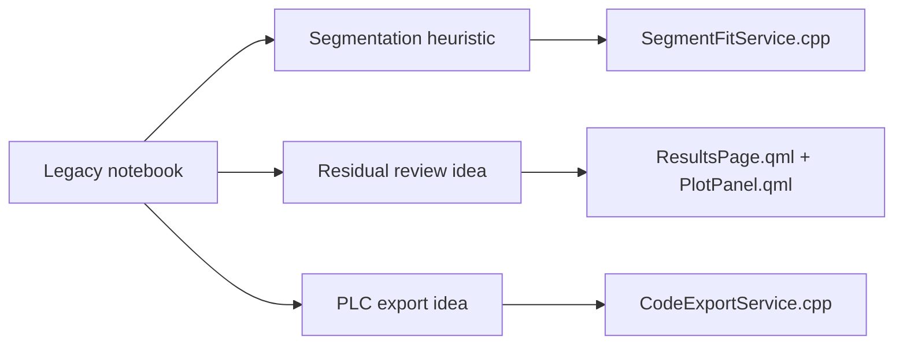

# Legacy Notebook

This page explains how the original notebook relates to the maintained Qt/C++ application.

The notebook is still stored at:

- `files/segmented_linear_fit.ipynb`

## Why It Is Still Useful

The notebook is no longer the main product path, but it still preserves the original exploration that motivated:

- growing candidate windows
- point-wise error acceptance
- `R^2` comparison
- residual inspection
- PLC-style export

## Relationship To The Current App

## What Stayed The Same

- candidate windows still grow from the current cursor
- absolute error is still a core signal
- `R^2` is still used as a fit-quality signal
- the result is still a set of piecewise line equations
- PLC-oriented export is still supported

## What Changed

| Notebook workflow | Current app workflow |
| --- | --- |
| ad hoc data loading | reusable CSV and manual input flows |
| exploratory cells | reusable classes and methods |
| notebook plots | QML chart panels |
| one-off environment | desktop application with persistent UI flow |
| PLC-only focus | multiple export targets |

## Recommended Use Today

Use the notebook as:

- historical reference
- algorithm intuition
- validation context when changing the segmentation heuristic

Use the Qt/C++ code as:

- the maintained implementation
- the authoritative runtime behavior
- the source for current UI and export logic
