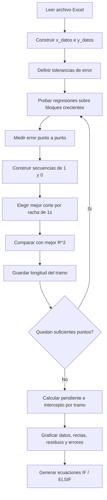

# Segmented Linear Fit Notebook

Documento de apoyo para entender [files/segmented_linear_fit.ipynb](../../files/segmented_linear_fit.ipynb).

## Que entendi

El notebook toma una relacion medida entre `input` y `output` y busca aproximarla con varias rectas en vez de una sola recta global.

La idea principal es esta:

- Se cargan datos medidos desde `datos2_CANOPEN.xlsx`.
- Se prueban regresiones lineales sobre bloques crecientes de puntos consecutivos.
- Cada bloque se evalua por error absoluto y por `R^2`.
- Se elige un corte que permita formar un tramo "aceptable".
- El proceso se repite con los puntos restantes.
- Al final se obtiene una aproximacion lineal por tramos.
- Con esos tramos se dibujan graficas y tambien se genera codigo tipo `IF / ELSIF` para PLC o logica embebida.

En otras palabras: el notebook intenta convertir una curva no lineal en una funcion lineal por segmentos.

## Flujo general



## Datos de entrada

El notebook usa este origen:

- Archivo esperado: `datos2_CANOPEN.xlsx`
- Hoja usada: la hoja activa del workbook
- Columnas finales del DataFrame: `Cantidad`, `output`, `input`

Despues convierte:

- `x_datos = df["input"].tolist()`
- `y_datos = df["output"].tolist()`

Interpretacion practica:

- `x_datos` es la variable de entrada del ajuste.
- `y_datos` es la variable que queremos aproximar con rectas.

## Variables importantes

- `errAbsMax`: tolerancia principal usada para decidir si un punto entra como valido dentro de un tramo.
- `errAbsMax_Comprobar`: tolerancia mas laxa usada luego para graficar y revisar errores.
- `minPoint = 3`: fuerza a evaluar al menos 4 puntos por tramo.
- `despValores`: guarda cuanto avanza el algoritmo en cada iteracion; termina definiendo los segmentos.
- `m_val_` y `b_val_`: pendientes e interceptos finales de cada recta.
- `x_Nuevo` y `y_Nuevo`: puntos agrupados por tramo.

## Como decide cada segmento

La parte central del notebook vive en el bucle `while len(x_datos_) > minPoint`.

Para cada iteracion hace esto:

1. Toma los puntos restantes.
2. Prueba una regresion lineal sobre los primeros `i` puntos, donde `i` va creciendo.
3. Para cada punto del bloque calcula el error absoluto entre el valor real y el valor predicho.
4. Si el error es menor que `errAbsMax`, guarda `1`. Si no, guarda `0`.
5. Eso genera una secuencia como `[1, 1, 1, 0, 0, 1]`.
6. La funcion `prioridadErr` mide la mayor racha consecutiva de `1`.
7. Se toma como mejor candidata la secuencia con la mejor racha.
8. En paralelo tambien se calcula el `R^2` de cada bloque.
9. Entre la posicion sugerida por error y la sugerida por `R^2`, el notebook se queda con la menor.
10. Esa posicion define hasta donde llega el tramo actual.
11. Luego elimina ese tramo de los datos restantes y repite.

## Salidas que genera

Despues de encontrar los cortes, el notebook hace cuatro cosas utiles:

### 1. Ajuste final por tramo

Para cada segmento recalcula:

- pendiente `m`
- intercepto `b`

Con eso obtiene ecuaciones de la forma:

```text
y = m*x + b
```

### 2. Graficas

El notebook genera varias visualizaciones:

- datos originales con sus rectas por tramo
- solo datos segmentados
- solo rectas finales
- residuos respecto a una recta global
- error absoluto por tramo

### 3. Evaluacion puntual

Prueba un valor fijo:

```python
vol1 = 1.57
```

Luego busca en que tramo cae ese valor y calcula su salida usando la recta correspondiente.

### 4. Codigo para PLC o logica embebida

Genera algo equivalente a esto:

```text
IF IN_VALUE >= limite_inferior AND IN_VALUE < limite_superior THEN
    OUT_LONG := m*IN_VALUE + b;
ELSIF ...
ELSE
    OUT_LONG := 0.0000;
END_IF
```

Eso permite llevar el ajuste por tramos fuera de Python.

## Estructura mental del notebook

Otra forma simple de leerlo es dividirlo en 5 bloques:

1. Instalacion e imports
2. Carga de datos
3. Busqueda de segmentos
4. Visualizacion y chequeo
5. Exportacion de ecuaciones

## Lo que hoy esta mas dificil de mantener

El notebook funciona como exploracion, pero todavia tiene varios puntos que convendria refactorizar si queremos volverlo codigo de produccion:

- El nombre del archivo de entrada esta fijo.
- La logica principal esta repartida en celdas y no en funciones reutilizables.
- Hay varias graficas separadas que podrian consolidarse.
- Los nombres de variables no siempre cuentan la intencion del paso.
- La eleccion del corte mezcla dos criterios: racha de errores validos y mejor `R^2`.
- El uso de `np.roll` para descartar puntos funciona, pero hace menos evidente el rango real del tramo.
- No hay pruebas automaticas que confirmen que los segmentos generados siguen siendo los mismos.

## Si quisieramos llevarlo a codigo mas limpio

Una version mas clara probablemente tendria estas funciones:

- `load_data(path)`
- `find_segments(x, y, err_abs_max, min_points)`
- `fit_segments(x, y, segment_limits)`
- `plot_segments(...)`
- `generate_plc_code(...)`

## Resumen corto

Mi lectura del notebook es esta:

- Busca aproximar una curva medida con varias rectas.
- Decide los cortes revisando error punto a punto y `R^2`.
- Usa esos cortes para recalcular las rectas finales.
- Dibuja resultados.
- Genera codigo final para usar ese ajuste fuera de Python.

Si seguimos trabajando sobre este repo, esta documentacion puede ser la base para el siguiente paso: pasar la logica del notebook a un modulo Python mas mantenible.
