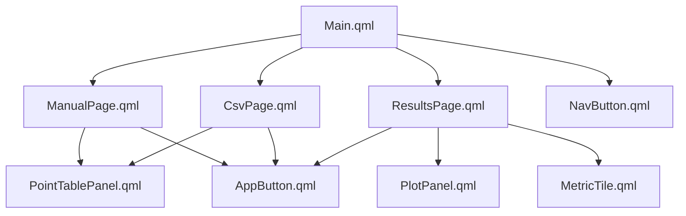
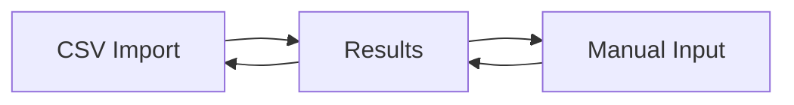

# QML Reference

This page explains the QML side of the application file by file.

## QML File Map

| File | Responsibility |
| --- | --- |
| `qml/Main.qml` | main window, page navigation, shared theme, dataset summary card |
| `qml/pages/CsvPage.qml` | CSV import workflow and table presentation for imported data |
| `qml/pages/ManualPage.qml` | range generation and custom points workflow |
| `qml/pages/ResultsPage.qml` | fit charts, error charts, segment list, and export panel |
| `qml/components/AppButton.qml` | reusable primary/secondary button |
| `qml/components/MetricTile.qml` | compact KPI tile used on results page |
| `qml/components/NavButton.qml` | sidebar navigation button |
| `qml/components/PointTablePanel.qml` | editable points list view |
| `qml/components/PlotPanel.qml` | custom chart panel rendered with `Canvas` |

## UI Composition

## `qml/Main.qml`

This is the application shell.

Main responsibilities:

- define the dark theme object
- own the page index
- configure the sidebar and status panel
- create the file dialog for CSV loading
- host the three pages inside a `StackLayout`

It also shows a summary card with:

- point count
- missing output count
- current output label

## `qml/pages/CsvPage.qml`

This page is dedicated to imported datasets.

Main behaviors:

- let the user open the native file picker
- display CSV header naming controls
- show dataset status for imported points
- trigger analysis
- present the shared `PointTablePanel`

Notable UI detail:

- if CSV headers are available, the page can use them for table labels and exported variable names

## `qml/pages/ManualPage.qml`

This page supports two workflows.

### Range mode

- input: minimum, maximum, intervals
- output: evenly spaced `X` values with empty `Y`

### Custom points mode

- create endpoint rows
- add arbitrary points
- edit `X` and `Y`
- delete rows
- sort by `X`

The page reuses the same table component but changes whether `X` is editable.

## `qml/pages/ResultsPage.qml`

This page is the most feature-rich screen in the UI.

It has three result sections:

- fit charts
- error charts
- copy results

### Fit chart modes

- combined
- measured only
- lines only

### Error chart modes

- global residual
- segment error

### Copy results section

- segment cards
- export target selector
- code preview text area
- copy button

## `qml/components/AppButton.qml`

Reusable button component with:

- shared dimensions
- primary versus secondary styling
- theme-driven colors

This keeps visual button behavior consistent across all pages.

## `qml/components/MetricTile.qml`

Small summary tile component used in the results header.

Each tile shows:

- label
- main value
- note
- accent color strip

## `qml/components/NavButton.qml`

Sidebar navigation button with:

- selected-state highlight bar
- title and subtitle
- theme-aware background and border handling

## `qml/components/PointTablePanel.qml`

This is the editable point list UI.

Features:

- row number badge
- configurable `X` and `Y` headers
- optional editable `X`
- always editable `Y`
- optional delete action
- visual highlighting for missing `Y`

This component is reused by both input pages, which keeps table behavior consistent.

## `qml/components/PlotPanel.qml`

This component draws charts with `Canvas`.

### Supported presentation features

- multiple named series
- markers and lines
- legend toggling
- reference lines
- residual tolerance bands
- point labels
- auto-computed axes and grid

### Why It Matters

The project avoids `QtCharts` and keeps the plotting logic lightweight and self-contained in one reusable component.

## Navigation And Interaction Flow

## Practical Reading Order

If you want to understand the QML layer:

1. read `qml/Main.qml`
2. read `qml/pages/CsvPage.qml`
3. read `qml/pages/ManualPage.qml`
4. read `qml/pages/ResultsPage.qml`
5. read `qml/components/PointTablePanel.qml`
6. read `qml/components/PlotPanel.qml`
